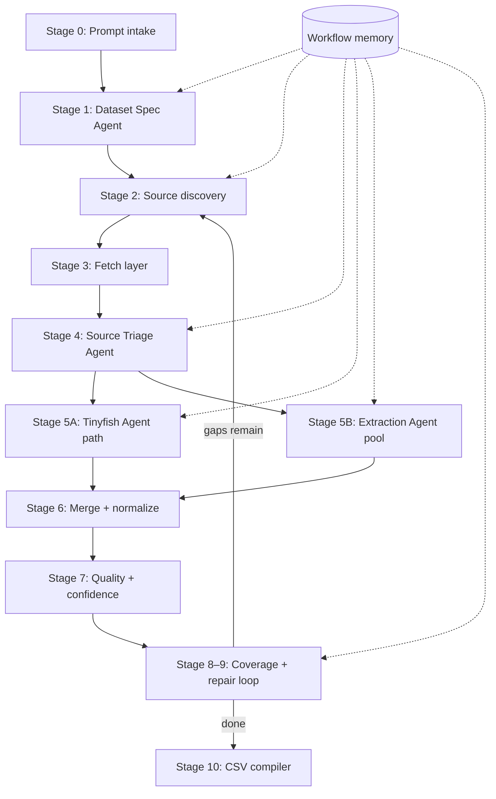

# BigSet Data Collection Agent — Architecture (v1.4)

This document describes the **current** end-to-end pipeline. It updates the original stage model with workflow memory, multi-loop repair, follow-up search/fetch, per-field confidence, selective exports, and recurring refresh.

**v1.4 release notes:** [v14-ai-sdk-benchmark-and-quality.md](v14-ai-sdk-benchmark-and-quality.md). **Planned efficiency (v1.5):** [v15-efficiency-planned.md](v15-efficiency-planned.md).

**Related docs:** [data-flow.md](data-flow.md) (types + JSON examples between stages), [AGENTS.md](AGENTS.md) (change guidelines).

## Change guidelines

- Treat bug reports and example inputs as evidence of a **failure mode**, not the full spec.
- Fix inside existing stages and types; avoid one-off wrappers or post-hoc patches.
- See [AGENTS.md](AGENTS.md) for full rules.

**Entry points**

| Command | Purpose |
|---------|---------|
| `bigset-collector run` | New collection from a user prompt |
| `bigset-collector refresh --from-run <id>` | Re-acquire data for a prior run; merge by primary key in place |

**External services**

| Service | Role |
|---------|------|
| **OpenRouter** | LLM for all agents (spec, triage, extract, repair, goals) via **Vercel AI SDK** (`generateText` + `Output.object`) |
| **Tinyfish Search** | Web search → candidate URLs |
| **Tinyfish Fetch** | Page content (markdown) + optional outbound links |
| **Tinyfish Agent** | Browser automation for navigation / forms / detail pages |

---

## Shareable architecture diagram (v1.4)

| File | Format |
|------|--------|
| [architecture-flowchart.png](architecture-flowchart.png) | PNG (recommended for Slack/email) |
| [architecture-flowchart.jpg](architecture-flowchart.jpg) | JPEG |
| [architecture-flowchart.svg](architecture-flowchart.svg) | SVG (scalable) |
| [architecture-flowchart.mmd](architecture-flowchart.mmd) | Mermaid source (edit and re-render) |

Re-render after editing the `.mmd` file:

```bash
cd backend/BigSet_Data_Collection_Agent/docs
npx -y @mermaid-js/mermaid-cli -i architecture-flowchart.mmd -o architecture-flowchart.png -b white -w 2400
```

---

## High-level flow



**Orchestrator:** `src/orchestrator/pipeline.ts` (collect + refresh), `acquisition.ts` (search/fetch/triage/extract bundle), `repair-loop.ts` (stages 8–9).

---

## Stage 0: User prompt intake

**What happens**

- CLI receives `--prompt`, `--target-rows`, feature flags (`--no-repair`, `--no-triage`, `--no-agent`), and output directory.
- **Refresh mode:** loads a prior run (`dataset_spec`, `evidence`, `workflow_memory`, `run_report`) instead of a new prompt-only start. See [v13-selective-results-and-refresh.md](v13-selective-results-and-refresh.md).

**Outputs**

- Run folder `runs/{run_id}/` (new id, or same id with `--in-place` refresh).
- `prompt` and `target_rows` stored in `run_report.json`.

**Code**

- `src/cli.ts`
- `src/storage/run-loader.ts` (refresh)

---

## Stage 1: Dataset Spec Agent

**What happens**

- **New run:** OpenRouter agent infers schema from the user prompt.
- **Refresh:** Reuses `dataset_spec.json` from the source run (no re-inference).
- Produces:
  - `row_grain` — what one CSV row represents
  - `columns[]` — name, type, description, `required`
  - `dedupe_keys` — **exactly one** column name: primary entity identifier for merge/repair
  - `search_queries` — seed searches for initial/refresh acquisition
  - `extraction_hints` — downstream extract guidance
- Required columns are ordered first; intent fields from the prompt are marked `required: true` so repair can run when data is sparse.

**Memory**

- Loads `memory/{prompt_fingerprint}.json` when `ENABLE_WORKFLOW_MEMORY=true`.
- Prior query/domain stats inform the spec agent on recurring prompts.

**Outputs**

- `dataset_spec.json`
- Snapshot in workflow memory: `extraction_schema`, `dedupe_keys`

**Code**

- `src/agents/dataset-spec.ts`
- `src/memory/workflow-memory.ts`, `store.ts`

---

## Stage 2: Source discovery (Search)

**What happens**

- Parallel Tinyfish Search calls (rate-limited queue).
- **Initial / refresh phase:** seed queries from the dataset spec (capped by `MAX_SEARCH_QUERIES`).
- **Repair phase:** mixed plan (see Stage 8):
  - **Curated** — new repair queries from the Coverage & Query Planning agent (page `0`).
  - **Pagination follow-up** — top historical query strings at the next Search API page (`last_page + 1`). See [v12-follow-up-repair.md](v12-follow-up-repair.md).
- Each hit becomes a `SourceCandidate` (`url`, `title`, `snippet`, `query`, `search_page`).

**Ranking (pre-fetch)**

- Candidates are scored and domain-deduplicated before Fetch (`rankCandidates` + `domainMemoryBoost` from workflow memory).

**Outputs**

- `source_candidates.json` (initial)
- In-memory candidate list per acquisition phase

**Code**

- `src/integrations/tinyfish.ts` — `searchWeb(query, page)`
- `src/orchestrator/acquisition.ts`
- `src/memory/search-pagination.ts` — `planRepairSearches`
- `src/queue/pools.ts` — `createSearchQueue`

---

## Stage 3: Fetch layer

**What happens**

- Top-ranked URLs are fetched in parallel batches (Tinyfish Fetch, markdown).
- **Repair + link follow:** primary fetch may request `links: true`; a second wave fetches heuristic-ranked outbound URLs (URL-only; future: agent picker). See `src/acquisition/link-follow.ts`.
- Already-seen URLs are skipped via a run-level `fetchedUrlSet` (refresh can optionally `--refetch-urls`).
- Pages stored under `runs/{id}/pages/{index}.meta.json` + `.md`.

**Outputs**

- `FetchedPage` objects (`text`, `title`, `final_url`, optional `outbound_links`, errors)

**Code**

- `src/integrations/tinyfish.ts` — `fetchPages`
- `src/orchestrator/acquisition.ts`
- `src/storage/run-store.ts` — `saveFetchedPage`

---

## Stage 4: Source Triage Agent

**What happens**

- Each successfully fetched page is classified in parallel (OpenRouter).
- **Statuses** (see `src/models/source-status.ts`):

| Status | Routing |
|--------|---------|
| `extract_now` | Direct extraction (Stage 5B) |
| `requires_navigation` | Tinyfish Agent (Stage 5A) |
| `requires_form_submission` | Agent |
| `requires_detail_page_followup` | Agent |
| `irrelevant` / `duplicate` / `blocked` / `low_value` | Skipped (or fallback extract if triage fails) |

- Emits **routing** `confidence` and **data** `source_data_confidence` (used later for field-level scoring).
- Workflow memory (`domain_stats_top` / `weak`) is injected into the triage prompt.

**Flags**

- `--no-triage`: skip classification; extract all pages.

**Outputs**

- `triage_{phase}.json` per acquisition label (`initial`, `refresh`, `repair_N`)
- `source_outcomes_{phase}.json` (v1.5.2) — per URL `triage_results` + `extraction_results` when inline extract ran

**Code**

- `src/agents/source-triage.ts`
- `src/orchestrator/process-pages.ts`

---

## Stage 5A: Navigation / Agent path

**What happens**

- For agent-classified pages (budget: `MAX_AGENT_RUNS_PER_PHASE`):
  1. **Agent Goal Agent** — generates a Tinyfish Agent goal from page + triage + memory.
  2. **Tinyfish Agent** — async queue + parallel poll (`run-async` / `runs.get`).
  3. **Extract-from-agent** — structured rows + evidence from agent result.
- Repair diagnosis may set `prefer_tinyfish_agent` to force agent for the whole repair acquisition.

**Outputs**

- `AgentRunRecord` per URL (goal, status, records extracted)
- Records merged into the same record stream as 5B

**Code**

- `src/agents/agent-goal.ts`, `extract-from-agent.ts`
- `src/integrations/tinyfish-agent.ts`
- `src/orchestrator/process-pages.ts`

---

## Stage 5B: Extraction Agent pool

**What happens**

- Parallel OpenRouter extraction from page markdown (`extract_now` and agent-disabled fallbacks).
- LLM returns `row`, sparse `evidence`, and `extraction_confidence`; `finalizeExtractedRecord()` attaches evidence URLs and `source_urls`. Provenance URL columns come from the LLM row; fetch URL is only a fallback when still empty.
- `focusFields` set during repair to target gap columns.
- Per-field confidence in exports is computed in Stage 7 (quality), not during extraction.

**Outputs**

- Raw records per acquisition phase (before merge)

**Code**

- `src/agents/extract.ts`
- `src/orchestrator/process-pages.ts`
- `src/queue/pools.ts` — `createExtractionQueue`

---

## Stage 6: Merge + normalize

**What happens**

- Records merged by **canonical id** (`pk:` from single `dedupe_keys[0]`, or `dk:` composite fallback when primary key empty).
- **Pair merge:** empty fields filled from newer pass; evidence and `source_urls` unioned; `extraction_confidence` = max of pair.
- **Refresh:** `mergeRepairIntoExisting(baseline, newRecords)` — same keys update in place, no duplicate entities.
- Unkeyed rows kept in `records_unkeyed.jsonl`.

**Outputs**

- In-memory merged dataset; snapshots `init_results.csv` after first acquisition pass.

**Code**

- `src/merge/records.ts` — `mergeRecords`, `mergeRepairIntoExisting`, `mergePair`

---

## Stage 7: Data quality & confidence

**What happens**

- Deterministic scoring (not a separate LLM agent): `scoreRecord` / `buildQualityReport`.
- **Completeness** — share of required columns filled.
- **Per-field confidence** — from evidence URL triage signals + extraction confidence (`src/quality/field-confidence.ts`).
- **Record `confidence_score`** — mean of required field confidences.
- **Status buckets:** `complete` | `partial` | `low_confidence`; `needs_review` flag with reasons.
- **Source outcomes** — per-URL success/fail/skip across phases.

**Outputs**

- `quality_report.json`
- `sources_outcomes.json`
- Segmented CSVs: `records_complete.csv`, `records_partial.csv`, etc.

**Code**

- `src/quality/score-record.ts`, `field-confidence.ts`, `build-report.ts`
- See [v10-quality.md](v10-quality.md)

---

## Stage 8: Coverage & query planning (repair loop)

**What happens**

- **Coverage analysis** (`analyzeCoverage`) — required-column gaps, `should_repair`, partial row examples.
- If repair enabled and gaps exist, up to `MAX_REPAIR_LOOPS` iterations:

```text
Per repair loop:
  8a. Repair Diagnosis Agent     → why gaps remain, domains/queries, agent preference
  8b. Repair Queries Agent       → new curated search strings (memory + diagnosis)
  8c. planRepairSearches()       → append pagination searches for top memory queries
  8d. Acquisition (repair_N)     → Search → Fetch (+ link follow) → Triage → Extract/Agent
  8e. mergeRepairIntoExisting    → fill gaps on existing rows; new primary keys add rows (triage may skip duplicate pages only when no new entities)
  8f. recordPhaseInMemory        → update query/domain/agent_goal stats
```

**Memory updates**

- Scored aggregates: per-query (incl. page breakdown), per-domain, per-agent-goal.
- Diagnoses and strategy notes appended for the next loop or a future run.

**Outputs**

- `repair_diagnosis_{n}.json`, `repair_queries_{n}.json` (includes `repair_searches`)
- `coverage_repair_{n}.json`

**Code**

- `src/coverage/analyze.ts`
- `src/agents/repair-diagnosis.ts`, `repair-queries.ts`
- `src/orchestrator/repair-loop.ts`
- See [v11-workflow-memory.md](v11-workflow-memory.md), [v12-follow-up-repair.md](v12-follow-up-repair.md)

---

## Stage 9: Stop or repeat

**Stop conditions (implemented)**

| Condition | Behavior |
|-----------|----------|
| No missing **required** fields | `should_repair = false` — exit repair loop |
| `repair_loop_count >= MAX_REPAIR_LOOPS` | Stop even if gaps remain |
| `ENABLE_REPAIR_LOOP=false` or `--no-repair` | Skip stage 8 entirely |
| Initial coverage satisfied | Repair never starts |

**Not implemented yet**

- Marginal-gain threshold (stop when a loop fills too few fields).
- LLM link-follow picker or extraction priority arbiter (planned; see team notes).

After repair (or skip), workflow memory is written to `workflow_memory.json` and `memory/{fingerprint}.json`.

---

## Stage 10: CSV compiler & reports

**What happens**

- **Selective export (v1.3):** `results.csv` contains only rows with **all required fields**, sorted by `completeness_pct` ↓ then `confidence_score` ↓. Per-required-field `{column}_confidence` columns included.
- **Full export:** `results_full.csv` + `evidence_full.jsonl` — entire merged dataset.
- **Evidence:** `evidence.jsonl` mirrors selective rows with quality + `field_confidences`.
- **Run report:** stats, repair summary, `visualization_records` count, optional `refreshed_from_run_id`.

**Outputs**

| Artifact | Description |
|----------|-------------|
| `results.csv` | Primary consumer-facing dataset (selective, ranked) |
| `results_full.csv` | Full merge + quality columns |
| `evidence.jsonl` / `evidence_full.jsonl` | Row + evidence + quality metadata |
| `run_report.json` | End-to-end stats and configuration echo |
| `init_results.csv` / `repair_results.csv` | Phase snapshots |

**Code**

- `src/export/csv-compiler.ts`, `select-results.ts`
- `src/storage/run-store.ts`

---

## Cross-cutting: Workflow memory

Persistent learning keyed by **prompt fingerprint** (`memory/{fingerprint}.json` + per-run `workflow_memory.json`).

| Store | Used for |
|-------|----------|
| `query_stats` | URL yield, record quality, search page, weighted quality |
| `domain_stats` | Fetch failures, avg completeness/confidence |
| `agent_goal_stats` | Agent URL + goal performance |
| `diagnoses` / `strategy_notes` | Repair narrative across loops |
| `last_missing_fields` | Agent context |

Injected into: Dataset Spec, Triage, Extract, Agent Goal, Repair Diagnosis, Repair Queries; also drives search pagination and domain-boosted URL ranking.

---

## Cross-cutting: Parallelism & limits

| Pool | Concurrency / limit | Backpressure |
|------|---------------------|--------------|
| Search | `SEARCH_CONCURRENCY`, `TINYFISH_SEARCH_RPM` | Rate limiter + retries |
| Fetch | `FETCH_CONCURRENCY`, `TINYFISH_FETCH_RPM` | Per-domain throttle |
| Triage / Extract | `TRIAGE_*`, `EXTRACTION_*`, `OPENROUTER_RPM` | Shared OpenRouter limiter |
| Agent | `AGENT_*`, `TINYFISH_AGENT_RPM` | Queue + poll concurrency |

See [v04-parallel.md](v04-parallel.md).

---

## Mapping: original stages → current

| Original | Current (v1.4) |
|----------|----------------|
| Stage 0: Prompt intake | Unchanged + **refresh** entry |
| Stage 1: Dataset Spec | Unchanged + memory-informed; skipped on refresh |
| Stage 2: Source Discovery | Search + **repair pagination** + memory-ranked fetch selection |
| Stage 3: Fetch | Unchanged + **link-follow** second wave on repair |
| Stage 4: Triage | Expanded status enum + memory + dual confidence scores |
| Stage 5A: Navigation Agent | Tinyfish Agent + goal agent + async batch |
| Stage 5B: Extraction pool | Parallel extract + extract-from-agent |
| Stage 6: Merge | Dedupe + **in-place refresh merge** |
| Stage 7: Quality agent | **Deterministic** scorer + **per-field confidence** |
| Stage 8: Coverage & planning | **Diagnosis agent** + **repair queries** + pagination plan |
| Stage 9: Stop/repeat | Multi-loop (`MAX_REPAIR_LOOPS`); no marginal-gain stop yet |
| Stage 10: CSV | **Selective + full** exports, segmented buckets, run report |

---

## Version-specific documentation

| Version | Topic |
|---------|--------|
| v0.3 | [Triage & navigation](v03-triage-navigation.md) |
| v0.4 | [Parallel workers](v04-parallel.md) |
| v1.0 | [Quality scoring](v10-quality.md) |
| v1.1 | [Workflow memory & multi-repair](v11-workflow-memory.md) |
| v1.2 | [Follow-up repair (pagination + links)](v12-follow-up-repair.md) |
| v1.3 | [Selective results & refresh](v13-selective-results-and-refresh.md) |
| v1.4 | [AI SDK, benchmark parity, extraction quality](v14-ai-sdk-benchmark-and-quality.md) |
| v1.5 | [Efficiency improvements](v15-efficiency-planned.md) (planned) |
| — | [Source selection heuristics](source-selection.md) |

---

## Planned extensions (not in codebase)

- **Link-follow agent** — replace URL heuristics for outbound link selection.
- **Extraction arbiter agent** — rank fetch/extract tasks by source type (curated vs pagination vs link).
- **Marginal-gain stop** — end repair when incremental field fills fall below a threshold.
