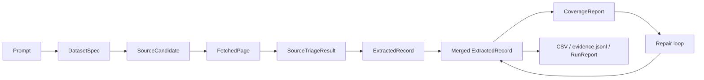

# Data flow and types between pipeline stages

This document describes **what data each stage produces and consumes**. Types are defined in `src/models/schemas.ts` unless noted.

See [architecture.md](architecture.md) for stage responsibilities, [AGENTS.md](AGENTS.md) for change guidelines, and [v14-ai-sdk-benchmark-and-quality.md](v14-ai-sdk-benchmark-and-quality.md) for the v1.4 release summary.

---

## LLM layer (Vercel AI SDK)

Structured agent calls use **`generateText` + `Output.object`** via `src/llm/complete-json.ts`, with **OpenRouter's official AI SDK provider** (`@openrouter/ai-sdk-provider`, not the OpenAI-compatible shim). System prompts use the `system` option; temperature is omitted by default for Gemini/reasoning models (set `OPENROUTER_TEMPERATURE` only when the model supports it).

Token usage is accumulated per pipeline run in **`runWithLlmUsageScope`** (`src/llm/usage.ts`) and written to:

- `PipelineResult.llmUsage`
- `run_report.json` → `llm_usage`
- Benchmark stdout → `usage.promptTokens` / `completionTokens` / `totalTokens`

The benchmark harness reads those fields directly (no estimation when `call_count > 0`).

---



**LLM stages:** Dataset Spec, Source Triage, Extraction (row values only), Agent Goal, Extract-from-agent (row values only), Repair Diagnosis, Repair Queries.

**Non-LLM stages:** Search, Fetch, Merge, Coverage, Quality scoring, CSV export.

---

## Stage 0 — Pipeline input

```json
{
  "prompt": "restaurants in Menlo Park that serve Coca-Cola",
  "targetRows": 25,
  "enableRepair": true,
  "enableTriage": true,
  "enableTinyfishAgent": true
}
```

Benchmark adapter adds `benchmark.requiredColumns` from `prompts.json` (see `src/agents/benchmark-spec.ts`).

---

## Stage 1 — DatasetSpec (LLM → validated JSON)

**Saved as:** `dataset_spec.json`

```json
{
  "intent_summary": "Restaurants in Menlo Park that serve Coca-Cola",
  "target_row_count": 25,
  "row_grain": "One row per restaurant",
  "columns": [
    { "name": "entity_name", "type": "string", "description": "Restaurant name", "required": true },
    { "name": "address", "type": "string", "description": "Street address", "required": true },
    { "name": "serves_requested_item", "type": "boolean", "description": "Menu shows Coca-Cola", "required": true },
    { "name": "source_url", "type": "string", "description": "URL where menu evidence was found", "required": true }
  ],
  "dedupe_keys": ["entity_name"],
  "search_queries": ["Menlo Park restaurants Coca-Cola menu", "..."],
  "extraction_hints": "Require menu or beverage list evidence."
}
```

**Rule:** `dedupe_keys` must contain **exactly one** column name — the primary entity identifier for merge and repair.

---

## Stage 2 — SourceCandidate (Tinyfish Search)

```json
{
  "url": "https://example.com/menu",
  "title": "Example Bistro Menu",
  "snippet": "Coca-Cola available...",
  "site_name": "example.com",
  "query": "Menlo Park restaurants Coca-Cola menu",
  "position": 1,
  "search_page": 0
}
```

---

## Stage 3 — FetchedPage (Tinyfish Fetch)

```json
{
  "url": "https://example.com/menu",
  "final_url": "https://example.com/menu",
  "title": "Menu",
  "text": "# Drinks\n\nCoca-Cola ...",
  "outbound_links": ["https://example.com/contact"]
}
```

---

## Stage 4 — SourceTriageResult (LLM, optional)

```json
{
  "url": "https://example.com/menu",
  "final_url": "https://example.com/menu",
  "title": "Menu",
  "status": "extract_now",
  "confidence": 0.9,
  "source_data_confidence": 0.85,
  "expected_yield": "partial",
  "reasoning": "Menu page lists beverages inline.",
  "suggested_action": "Extract drink list."
}
```

Routing (v1.5.2): `extract_now` → inline extract in the **same** combined LLM call; `requires_*` → Tinyfish Agent (if enabled); others → skip.

**Artifacts per phase:** `triage_{phase}.json` (triage only, same as before) and `source_outcomes_{phase}.json` (per URL: `triage_results` + `extraction_results` when inline extract ran).

Revert to v1.4 two-call path: `ENABLE_COMBINED_TRIAGE_EXTRACT=false`.

---

## Stage 5 — Extraction (combined or legacy)

### Combined LLM output (v1.5.2 default)

One call returns strict top-level keys:

```json
{
  "triage_results": { "...": "see Stage 4 shape" },
  "extraction_results": {
    "records": [ "..." ],
    "notes": "optional"
  }
}
```

When `triage_results.status` is not `extract_now`, `extraction_results.records` must be `[]` (post-processing ignores stray rows).

Page markdown uses **2× `MAX_PAGE_CHARS`** (`TRIAGE_EXTRACT_MAX_PAGE_CHARS`). Default `TRIAGE_CONCURRENCY=10`.

### Legacy / agent / fallback extraction

Separate `extractFromPage` or `extractFromAgentResult` still used when triage is disabled, agent returns JSON, combined call fails, or `ENABLE_COMBINED_TRIAGE_EXTRACT=false`.

### LLM row shape (row + sparse evidence + confidence)

Inline and legacy extract paths return `row`, optional `evidence`, and `extraction_confidence`. They do **not** return `source_urls`.

```json
{
  "records": [
    {
      "row": {
        "entity_name": "Stripe",
        "pricing_page_url": "https://stripe.com/pricing",
        "plan_or_price": "Standard — 2.9% + 30¢ per card charge",
        "source_url": "https://stripe.com/pricing"
      },
      "evidence": [
        {
          "field": "plan_or_price",
          "quote": "2.9% + 30¢ per successful card charge"
        }
      ],
      "extraction_confidence": 0.85
    }
  ],
  "notes": "Multiple plans on page; extracted Standard tier only."
}
```

### Post-processing (`finalizeExtractedRecord` in `src/agents/extract.ts`)

Code keeps LLM **row** values (including provenance URL columns the model set per row). It then:

- Keeps `evidence[].url` from the LLM when provided; uses the fetch `pageUrl` only when the model omitted `url`
- Sets `source_urls` from the page URL plus any `http` URLs on evidence items
- **Fallback only:** if a required provenance column is still empty, uses the fetch `pageUrl` (does not overwrite LLM-provided URLs)

### Final ExtractedRecord

```json
{
  "row": {
    "entity_name": "Stripe",
    "pricing_page_url": "https://stripe.com/pricing",
    "plan_or_price": "Standard — 2.9% + 30¢ per card charge",
    "source_url": "https://stripe.com/pricing"
  },
  "evidence": [
    {
      "field": "plan_or_price",
      "url": "https://stripe.com/pricing",
      "quote": "2.9% + 30¢ per successful card charge"
    }
  ],
  "source_urls": ["https://stripe.com/pricing"],
  "extraction_confidence": 0.85
}
```

**Per-field confidence** in CSV quality columns is computed later in Stage 7 (quality scoring), not by the extraction LLM.

---

## Stage 6 — Merge

Input: flat `ExtractedRecord[]` from all pages/agents in a phase.

- Identity: `canonicalRecordId` uses the single `dedupe_keys[0]` value (`pk:{normalized_name}`).
- `mergePair`: fills empty cells from newer records; unions evidence and `source_urls`.
- Repair merge uses the same merge — **new primary keys add new rows**; existing keys update in place.

---

## Stage 7 — CoverageReport (code)

```json
{
  "total_records": 12,
  "required_columns": ["entity_name", "address", "serves_requested_item", "source_url"],
  "field_gaps": [
    {
      "column": "serves_requested_item",
      "description": "Menu shows Coca-Cola",
      "missing_count": 8,
      "missing_pct": 0.67,
      "example_rows": [{ "entity_name": "Foo Bar", "serves_requested_item": null }]
    }
  ],
  "should_repair": true,
  "complete_count": 4,
  "partial_count": 8,
  "partial_record_ids": ["pk:foo bar", "..."]
}
```

---

## Stage 8 — Repair loop (optional)

1. **RepairDiagnosis** (LLM) — why gaps remain, domain/query hints
2. **RepairQueries** (LLM) — new search strings
3. Repeat Search → Fetch → Triage → Extract
4. `mergeRepairIntoExisting` — fill gaps **and** accept new entities

Repair acquisition passes `knownEntityKeys` so triage can mark truly duplicate pages as `duplicate` (skipped). Triage should **not** mark `duplicate` when the page may still yield entities not in `known_entities` — those pages are extracted and can add new rows via merge.

---

## Stage 9 — Export

| File | Contents |
|------|----------|
| `init_results.csv` | After first acquisition |
| `results_full.csv` | All merged rows |
| `results.csv` | Selective: all required fields filled, ranked by quality |
| `evidence.jsonl` | Selective rows + evidence + quality metadata |
| `run_report.json` | Full run stats |

---

## Benchmark vs CLI row counts

Benchmark runs often report **fewer rows** than CLI for the same prompt. Common causes (not mutually exclusive):

| Factor | Benchmark | CLI default |
|--------|-----------|-------------|
| `targetRows` | `COLLECTION_AGENT_TARGET_ROWS=8` | `-t 25` |
| Row cap | `targetRows * 2` = 16 | 50 |
| Repair | `COLLECTION_AGENT_ENABLE_REPAIR=false` | `ENABLE_REPAIR_LOOP=true` |
| Output rows | Bridge uses **selective** `visualizationRecords` (`results.csv` filter) | User sees `results.csv` + `results_full.csv` |
| Required columns | Harness `requiredColumns` merged into spec — partial rows fail selective filter | Spec from prompt only |

**Example:** 16 partial rows merged, 0 with all benchmark required fields filled → `visualization_records=0` → benchmark JSON has 0 rows, while `results_full.csv` has 16.

To compare fairly: use the same `targetRows`, repair flags, and read `results_full.csv` / disable `ENABLE_SELECTIVE_RESULTS` for harness output.

---

## Benchmark JSON contract (external)

`backend/src/dataset-agent/collection-bridge.ts` maps `ExtractedRecord` → harness format:

```json
{
  "rows": [
    {
      "cells": { "entity_name": "Example", "source_url": "https://..." },
      "sourceUrls": ["https://..."],
      "evidence": [{ "columnName": "entity_name", "sourceUrl": "https://...", "quote": "..." }],
      "needsReview": false
    }
  ]
}
```

By default rows come from selective export (complete required fields only).
