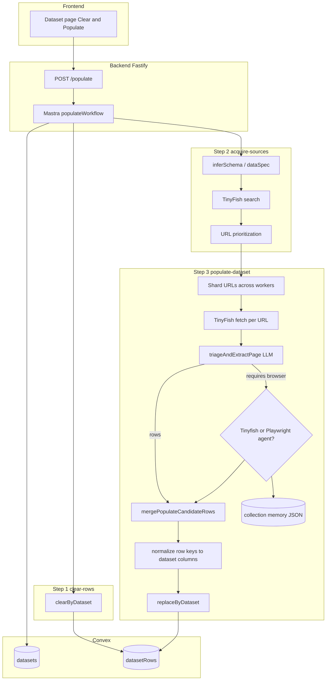

# Populate collection architecture

This document describes the **HTTP populate workflow** used by Bigset today (`POST /populate` → Mastra `populateWorkflow`). It is the parallel **triage + extract** pipeline in `backend/src/pipeline/`, not the vendored `BigSet_Data_Collection_Agent` CLI (which has its own repair loop and memory under `BigSet_Data_Collection_Agent/src/memory/`).

## End-to-end data flow

## Workflow steps

| Step | Module | What happens |
|------|--------|----------------|
| `clear-rows` | `mastra/workflows/populate.ts` | Deletes existing rows for the dataset. |
| `acquire-sources` | `populate-acquisition.ts` | Resolves `dataSpec` (columns + search queries), runs TinyFish search, scores URLs, returns `prioritizedUrls`. |
| `populate-dataset` | `populate-parallel.ts` | Fetches each prioritized URL, runs combined triage+extract LLM, optionally runs browser agents, merges/dedupes rows, normalizes keys, writes to Convex. |

## Parallel worker shard

For each prioritized URL:

1. **Fetch** — `webTools.fetch` (TinyFish fetch API).
2. **Triage + extract** — `triageAndExtractPage` (single LLM call) returns `PopulateSourceTriageResult` + candidate rows.
3. **Agent deferral** — If triage status needs a browser agent (`populate-source-status.ts`), the URL is queued as an `AgentDeferredCandidate` with a **goal** string from `buildTinyfishAgentGoal`.

After all shards finish:

4. **Browser agents** (budget-limited):
   - **Tinyfish** (default on): runs for candidates **without** a saved Tinyfish process in collection memory.
   - **Playwright** (default off): runs for candidates **with** a saved `emitted_process` when `POPULATE_ENABLE_PLAYWRIGHT_AGENT=true`.
5. **Extract from agent** — `extractFromTinyfishAgentResult` (same code path for Playwright `result` shape).
6. **Merge** — `mergePopulateCandidateRows` by `primary_key` from extraction spec.
7. **Key normalization** — `normalizePopulateRowCellsForDataset` maps snake_case LLM keys → dataset column display names.
8. **Convex write** — `internal.datasetRows.replaceByDataset`.

## Collection memory (central store)

Path: `POPULATE_COLLECTION_MEMORY_DIR` / `{datasetId}.json` (default `.bigset/collection-memory/`).

| Field | Purpose |
|-------|---------|
| `repair_loop` | Placeholder for a future quality repair pass (`idle` today). |
| `agent_visited_urls` | Append-only log of Tinyfish/Playwright visits, including `emitted_process` for replay. |

Loaded at the start of `populate-dataset` and saved after the parallel phase. **Does not change** triage, fetch, or merge logic unless Playwright replay is explicitly enabled.

Implementation: `backend/src/pipeline/collection-memory/`.

## Environment flags (populate)

| Variable | Default | Effect |
|----------|---------|--------|
| `POPULATE_ENABLE_COLLECTION_MEMORY` | `true` | Persist memory JSON per dataset. |
| `POPULATE_COLLECTION_MEMORY_DIR` | `.bigset/collection-memory` | Memory directory. |
| `POPULATE_ENABLE_TINYFISH_AGENT` | `true` | Run Tinyfish for agent-deferred URLs. |
| `POPULATE_MAX_TINYFISH_AGENT_RUNS` | `5` | Cap per populate run. |
| `POPULATE_ENABLE_PLAYWRIGHT_AGENT` | `false` | Use Playwright replay when memory has a prior Tinyfish process. |
| `POPULATE_MAX_PLAYWRIGHT_AGENT_RUNS` | `5` | Cap per populate run. |
| `POPULATE_URLS_PER_WORKER` | `5` | Shard size for parallel fetch/triage. |

See also `backend/.env.example` and `populate-parallel-config.ts`.

## Related code paths

| Path | Role |
|------|------|
| `backend/src/index.ts` | HTTP entry, auth, starts workflow. |
| `backend/src/mastra/workflows/populate.ts` | Workflow orchestration + memory load/save. |
| `backend/src/pipeline/populate-parallel.ts` | Core parallel populate + agent dispatch. |
| `backend/src/pipeline/populate-tinyfish-agent.ts` | Tinyfish Agent queue + poll. |
| `backend/src/pipeline/populate-playwright-agent.ts` | **Dock** for Edward's Playwright agent (stub). |
| `backend/src/pipeline/populate-normalize-dataset-keys.ts` | Convex row key alignment. |
| `BigSet_Data_Collection_Agent/` | Standalone collection + repair loop (separate memory schema). |

## Future: repair loop

`repair_loop` in collection memory mirrors the collection agent's repair concept but is **not wired** into the populate workflow yet. When implemented, it should:

1. Read coverage gaps from merged rows.
2. Bump `repair_loop.current_loop`.
3. Run additional acquisition/agent passes.
4. Append diagnoses (similar to `BigSet_Data_Collection_Agent/src/orchestrator/repair-loop.ts`).

Until then, `repair_loop.status` stays `idle`.
