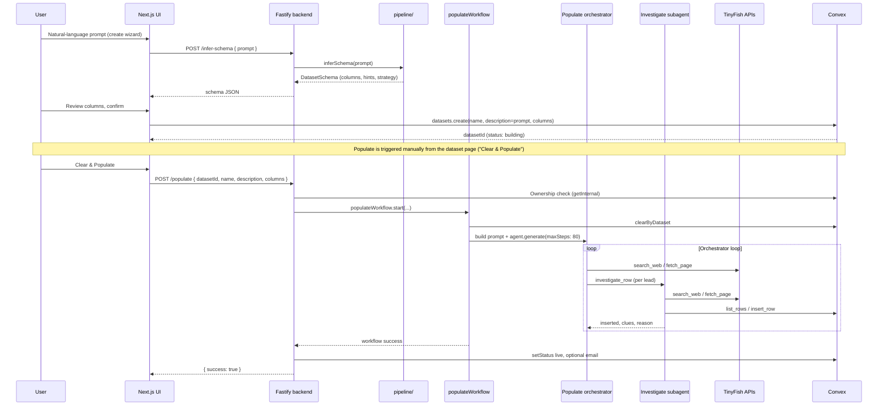
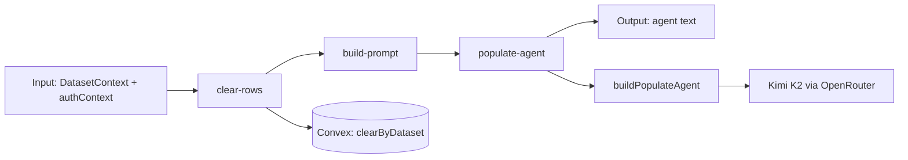

# Data collection agents — architecture and data flow

This document explains how BigSet turns a **user data-collection prompt** into rows in a Convex dataset, based on `backend/src/mastra/` and `backend/src/pipeline/`.

There are two distinct phases:

1. **Schema inference** — the user describes what they want; an LLM proposes columns and metadata (no web search, no rows).
2. **Populate** — after the dataset exists, a **two-tier Mastra agent** system searches the web and inserts rows (orchestrator + per-lead subagents).

---

## End-to-end lifecycle



| Phase | Entry point | Mastra? | Web search? | Writes rows? |
|-------|-------------|---------|-------------|--------------|
| Schema inference | `POST /infer-schema` | Optional workflow in Studio only; HTTP calls `pipeline/schema-inference.ts` directly | No | No |
| Populate | `POST /populate` | Yes — `populateWorkflow` | Yes — TinyFish Search + Fetch | Yes — via investigate subagents only |
| Update (scheduled refresh) | `POST /update` | `updateWorkflow` stub | Not yet | Not yet |

---

## Directory roles

```text
backend/src/
├── pipeline/                    # Pure, testable logic (no Mastra)
│   ├── types.ts                 # Zod schemas: DatasetSchema, columns, run manifest types
│   ├── schema-inference.ts      # LLM: prompt → structured schema (Claude Sonnet via OpenRouter)
│   └── populate.ts              # Zod: DatasetContext (id, name, description, columns) for /populate
│
├── mastra/
│   ├── index.ts                 # Registers workflows for Mastra Studio (agents built per-run)
│   ├── workflows/
│   │   ├── infer-schema.ts      # Thin wrapper around pipeline inferSchema (Studio)
│   │   ├── populate.ts          # clear-rows → build-prompt → populate-agent
│   │   └── update.ts            # Placeholder — "logic not yet implemented"
│   ├── agents/
│   │   ├── populate.ts          # Orchestrator factory (search only, delegates writes)
│   │   └── investigate.ts       # Subagent factory (deep research + insert_row)
│   └── tools/
│       ├── web-tools.ts         # search_web, fetch_page → TinyFish APIs
│       ├── investigate-tool.ts  # investigate_row → spawns investigate agent per call
│       └── dataset-tools.ts     # insert_row, list_rows, … scoped by dataset closure
│
└── index.ts                     # HTTP: /infer-schema, /populate, /update
```

**Pipeline** holds shared types and the schema-inference LLM call. **Mastra** wires multi-step workflows and agent tool loops for population.

---

## How the user prompt is used

The same natural-language intent shows up in different shapes at each stage.

### 1. Create dataset (wizard)

| Field | Source |
|-------|--------|
| User input | Free-text prompt on `/dataset/new` |
| `POST /infer-schema` body | `{ prompt }` |
| Convex `datasets.description` | Original user prompt (stored on create) |
| Convex `datasets.columns[].description` | Per-column `retrieval_hint` from inferred schema (mapped in the UI) |

Schema inference (`pipeline/schema-inference.ts`) asks the model for:

- `dataset_name`, `description`, `columns` (with `retrieval_hint` per column)
- `primary_key`, `retrieval_strategy` (`search_fetch` | `browser` | `hybrid`)
- `source_hint` (preferred starting URL)

Those extra schema fields are **not** passed into the populate workflow today. Population relies on:

- **`description`** — still the user’s original prompt
- **`columns[].name` / `type` / `description`** — column descriptions often contain the inference-time retrieval hints

### 2. Populate run

`populateWorkflow` step `build-prompt` composes the orchestrator’s user message:

```text
Dataset: {datasetName}
Description: {description}

Data fields to collect:
- "{column.name}" ({type}): {column.description}
...

Search the web broadly to find real entities that fit this dataset topic.
For each lead you find, call investigate_row to hand it off to a subagent...
```

Important design choices:

- **`datasetId` is omitted** from the LLM prompt so the model cannot redirect writes to another dataset (tools are closure-scoped to the authorized id).
- The orchestrator is told **not** to insert rows itself — only `investigate_row` subagents write.

Each `investigate_row` call builds a subagent prompt:

```text
Entity: {entity_hint}
Context (partial data already found): {context}
Useful URLs: ...
Additional notes: ...
```

`entity_hint`, `context`, `urls`, and `notes` come from the orchestrator’s prior searches and from **CLUES** returned by earlier subagents.

---

## Populate workflow (Mastra)

Registered as `populate-workflow` in `mastra/index.ts`. Steps run in order:



### Step 1: `clear-rows`

Deletes all existing rows for the dataset via `internal.datasetRows.clearByDataset`. A populate run always starts from an empty table (“Clear & Populate” in the UI).

### Step 2: `build-prompt`

Maps workflow input into:

- `prompt` — text for the orchestrator (see above)
- `authorizedDatasetId`, `authContext`, `columns` — passed through to the agent step (not shown to the LLM)

### Step 3: `populate-agent`

- Calls `buildPopulateAgent(authorizedDatasetId, authContext, columns)`
- Runs `agent.generate(prompt, { maxSteps: 80 })`
- Returns `{ text }` (final assistant message; row data already persisted by subagents)

### Auth context (server-only)

Set in `index.ts` when starting the workflow:

```ts
authContext: {
  authorizedUserId: req.auth.userId,  // Clerk JWT
  workflowRunId: run.runId,
}
```

Used for logging and PostHog `CAPABILITY_VIOLATION` events — not for Convex user identity (admin client bypasses Clerk inside mutations).

---

## Two-tier agent model (current update)

Population uses an **orchestrator / subagent** split introduced to separate breadth-first discovery from verified per-row writes.

### Orchestrator (`agents/populate.ts`)

| Property | Value |
|----------|--------|
| Model | `moonshotai/kimi-k2-0905` (OpenRouter) |
| Tools | `search_web`, `fetch_page`, `investigate_row` |
| Writes rows? | **No** |
| Max steps | 80 (workflow step) |

**Instructions (summary):**

1. Run **3 parallel searches** covering different angles of the topic.
2. For each promising lead, call **`investigate_row`** with partial data and URLs.
3. Batch discipline: first **3** parallel investigations, then up to **10**, then unlimited batches.
4. Use **CLUES** from subagent responses to drive the next batch.
5. Stop at **20 inserted rows** or when leads are exhausted.

### Subagent (`agents/investigate.ts`)

Spawned **fresh per `investigate_row` call** (not cached).

| Property | Value |
|----------|--------|
| Model | Same Kimi K2 |
| Tools | `search_web`, `fetch_page`, `insert_row`, `list_rows` |
| Max steps | 25 per investigation |
| Scope | One entity → at most one new row |

**Instructions (summary):**

1. `list_rows` — avoid duplicates.
2. Use orchestrator context + targeted searches + page fetches.
3. `insert_row` only with verified data; empty string for unknown fields.
4. End with structured lines: `INSERTED`, `SUMMARY`, `CLUES`, `REASON`.

`investigate-tool.ts` parses that footer and returns:

```ts
{ inserted: boolean, row_summary?, clues?, reason: string }
```

The orchestrator reads `clues` to find more entities (list pages, URL patterns, queries that worked).

```mermaid
flowchart TB
  subgraph Orchestrator
    S1[search_web x3 parallel]
    S2[fetch_page on promising URLs]
    I[investigate_row batches]
    S1 --> S2 --> I
  end

  subgraph Subagent per lead
    L[list_rows]
    S3[2-4 targeted searches]
    F[fetch_page verify]
    INS[insert_row if verified]
    L --> S3 --> F --> INS
  end

  I --> Subagent per lead
  INS --> CV[(Convex datasetRows)]
  Subagent per lead -->|CLUES| I
```

---

## Web search and page fetch

Implemented in `tools/web-tools.ts`. Both require **`TINYFISH_API_KEY`**.

### `search_web`

- **API:** `GET https://api.search.tinyfish.ai?query=...`
- **Returns:** `{ results: [{ title, snippet, url }] }` or `{ error }`
- **Used by:** orchestrator (broad discovery) and subagents (targeted verification)

### `fetch_page`

- **API:** `POST https://api.fetch.tinyfish.ai` with `{ urls: [url], format: "markdown" }`
- **Returns:** `{ title, text }` (markdown truncated at 15k chars) or `{ error }`
- **Used by:** both agents after search to read full page content

Errors (rate limit, bot block, timeout) are returned as tool errors so the LLM can retry or fall back to snippets.

**Note:** Schema inference can label `retrieval_strategy: "browser"`, but **no browser automation tool** is wired into Mastra agents yet — only search + fetch.

---

## Dataset writes and security

`tools/dataset-tools.ts` builds tools via `buildPopulateTools(authorizedDatasetId, authContext)`:

- **`insert_row` / `list_rows`** — no `datasetId` in the tool schema; dataset id is fixed in a JS closure.
- **`get_row` / `update_row` / `delete_row`** — available on the tool factory but only **`insert_row` and `list_rows`** are exposed to the investigate subagent today.

Convex mutations use the backend’s **admin** Convex client. Defense in depth:

1. HTTP `/populate` checks `dataset.ownerId === req.auth.userId`.
2. Tools cannot target a different dataset id.
3. Row-level ops verify `row.datasetId === authorizedDatasetId` (uniform “Row not found” on mismatch).

---

## HTTP API contracts

### `POST /infer-schema` (protected)

```json
{ "prompt": "YC fintech companies currently hiring" }
```

→ Returns `DatasetSchema` (`pipeline/types.ts`).

### `POST /populate` (protected)

```json
{
  "datasetId": "...",
  "datasetName": "YC Fintech Hiring",
  "description": "user's original prompt",
  "columns": [
    { "name": "Company", "type": "text", "description": "..." }
  ]
}
```

→ Runs workflow synchronously (client waits until finished).

Post-success (best-effort):

- Row count &gt; 0 → `datasets.status = "live"`
- Optional “dataset ready” email via Resend

### `POST /update` (protected)

Same body shape as populate; workflow currently returns a stub message. Scheduled refresh is not implemented.

---

## Mastra Studio

`backend/Dockerfile.mastra` runs `npx mastra dev` on port **4111**.

Registered workflows: `inferSchemaWorkflow`, `populateWorkflow`, `updateWorkflow`.

**Populate agent is intentionally not registered** in `mastra/index.ts` — it must be built per run with a real `authorizedDatasetId`. Studio can still inspect the populate **workflow** end-to-end.

---

## Typical run narrative (example)

**User prompt:** “Starbucks menu items with calories on the US nutrition page”

1. **Infer schema** — model proposes columns (item name, calories, category, …), `source_hint` might be a Starbucks nutrition URL, `retrieval_strategy: search_fetch`.
2. **Create dataset** — description stores the full prompt; column descriptions store retrieval hints.
3. **User clicks Clear & Populate** — workflow clears rows, builds orchestrator prompt from name + description + columns.
4. **Orchestrator** — searches e.g. “Starbucks US nutrition PDF”, “Starbucks drink calories site:starbucks.com”, fetches listing pages, identifies leads (“Pike Place Roast 12oz”).
5. **`investigate_row`** — subagent checks duplicates, fetches detail pages, fills columns, `insert_row` if verified, returns `CLUES: nutrition PDF lists all hot drinks by category`.
6. **Orchestrator** — uses clues for more `investigate_row` calls until ~20 rows or exhaustion.
7. **Backend** — marks dataset `live`, may email the user.

---

## Gaps and future hooks

| Item | Status |
|------|--------|
| `updateWorkflow` | Stub only |
| `retrieval_strategy` / `source_hint` in populate prompt | Not wired; only via description/column text |
| Browser / hybrid strategy | Schema field exists; no browser tool in agents |
| Orchestrator row cap (20) | Instruction-only; not enforced in code |
| `inferSchemaWorkflow` vs HTTP | HTTP bypasses Mastra; same `inferSchema` function |

---

## Key file index

| Concern | File |
|---------|------|
| HTTP routes | `backend/src/index.ts` |
| Workflow steps | `backend/src/mastra/workflows/populate.ts` |
| Orchestrator agent | `backend/src/mastra/agents/populate.ts` |
| Subagent agent | `backend/src/mastra/agents/investigate.ts` |
| Delegate tool | `backend/src/mastra/tools/investigate-tool.ts` |
| Web APIs | `backend/src/mastra/tools/web-tools.ts` |
| Convex CRUD tools | `backend/src/mastra/tools/dataset-tools.ts` |
| Populate input schema | `backend/src/pipeline/populate.ts` |
| Schema inference LLM | `backend/src/pipeline/schema-inference.ts` |
| Frontend triggers | `frontend/lib/backend.ts`, `frontend/app/dataset/[id]/page.tsx` |
