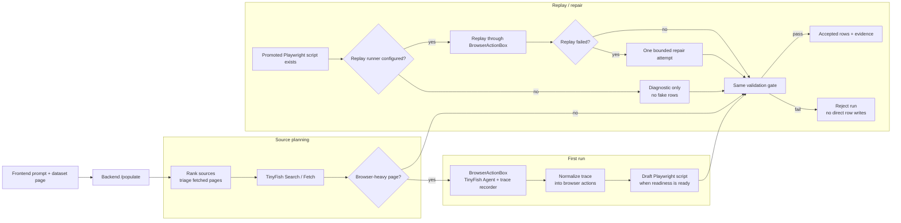

# BigSet PR67 Self-Healing Flow

Public-safe note for the in-app populate path. No transcripts, no private links, no secrets.

## Overview

1. The frontend sends the dataset prompt and context to backend `/populate`.
2. Backend loads the dataset, then runs source planning, ranking, and triage in `backend/src/pipeline/populate-source-planner.ts`.
3. TinyFish trace normalization in `backend/src/pipeline/populate-tinyfish-trace-recorder.ts` turns agent runs into replayable browser actions when the trace supports it.
4. BrowserActionBox in `backend/src/pipeline/populate-browser-action-box.ts` handles first run, replay, and one bounded repair attempt.
5. Validation still decides `accepted_full`, `accepted_partial`, or `rejected`.
6. Replay and repair reuse the same validation path. They do not write rows directly.
7. Only validated results can be promoted or written.

## What PR67 proves now

- Source planning, ranking, and triage now live in the backend.
- TinyFish traces normalize into the same runtime shape used by populate.
- A real TinyFish canary now captures raw run steps, artifacts, evidence-backed rows, replayable browser actions, and a draft Playwright script.
- BrowserActionBox replay and one-shot repair are wired into the self-healing contract and covered by fixture tests.
- Replay and repair do not create rows on their own.
- Public artifacts now include `tinyfish-trace`, `playwright-replay-result`, `playwright-repair-diagnostic`, `playwright-repaired-script`, and `validation-result`.

## Honest Proof Status

| Area | Status |
| --- | --- |
| Source planning/ranking/triage | Implemented, unit-tested, and exercised through `/populate`. |
| TinyFish first-run trace | Implemented, unit-tested, and proven with a real local canary. |
| Draft script generation | Implemented and proven when TinyFish exposes replayable browser actions. |
| Replay before Agent spend | Wired, unit-tested, and proven with local Chromium replay. |
| Repair and promotion | Wired, unit-tested, and proven with one forced-failure repair canary. |
| Default server replay runtime | Docker backend includes `playwright-core` plus system Chromium; replay can be disabled with `POPULATE_ENABLE_PLAYWRIGHT_REPLAY=false`. |

## Phase 2 BrowserActionBox

- First run records the TinyFish trace, normalizes browser actions, and drafts a Playwright script when readiness allows.
- Replay uses a promoted script first when the source URL, schema, and goal match.
- Repair gets one bounded retry, and any promoted repaired script still goes back through validation.
- Readiness is `ready` only when the trace includes explicit replayable browser actions.
- The local Playwright runner executes the generated script with a bounded timeout, then extracts Agent-compatible rows from the resulting DOM if the script itself returns no rows.
- If replay is disabled or unavailable, replay is diagnostic-only and normal populate can continue through the trusted path.
- The trust shell stays intact: validation is mandatory, and replay or repair never write fake rows.

## What works now / What is next / How to verify

### What works now

- Backend source planner, trace recorder, BrowserActionBox contract, and validation gate.
- Accepted rows and evidence still show in the UI.
- Rejected runs still write no fake rows.
- Real TinyFish first-run canary produces rows, evidence, run steps, artifacts, replayable actions, and a draft script.
- Real replay canary runs the draft script through local Chromium before spending TinyFish Agent again.
- Forced repair canary retargets a broken generated script and promotes the repaired script only after replay validates.

### What is next

- Improve extraction specificity for source families beyond title/link/evidence-style pages.
- Replace the deterministic repair helper with an LLM repair agent once the product wants broader selector repair.

### How to verify

1. Start the local stack with `make dev`.
2. Run a populate flow on a browser-heavy page.
3. Confirm source URL, evidence, and validation state appear.
4. Confirm replay and repair artifacts show only when browser actions exist.
5. Confirm rejected runs write no rows.

## Diagram

Rendered diagram: [bigset-populate-target-loop.svg](assets/bigset-populate-target-loop.svg)

Mermaid source: [self-healing-data-collection-flow.mmd](self-healing-data-collection-flow.mmd)

