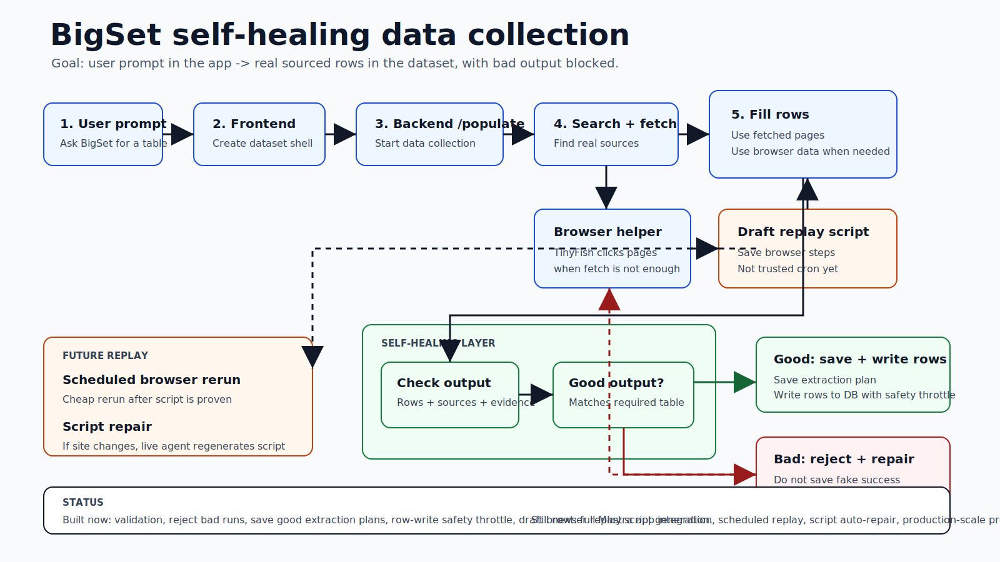

# Self-Healing Data Collection Flow

Purpose: public-safe architecture note for the BigSet data collection integration. No transcript paste, no private links, no secrets.

## Short Version

Team direction changed from "compare the standalone collection pipeline against Mastra" to "move the useful collection-pipeline ideas into the Mastra app path."

Goal: one app-integrated system where a user can type a dataset request in BigSet, create the table, populate rows from real sources, reject bad output, and eventually rerun the working browser steps cheaply.

PR67 demo goal: one draft PR that a teammate can check out, run with `make dev`, open in the BigSet frontend, create a dataset from a prompt, run populate, and inspect either accepted rows with source/evidence behavior or a clear rejection state with zero fake rows written.

Product path: use the BigSet app path with Mastra as the orchestrator and TinyFish as the web capability layer. In the current Mastra path, `search_web` and `fetch_page` are backed by TinyFish Search and TinyFish Fetch. For browser-heavy sources, the target path should call the TinyFish Agent endpoint, capture explicit browser actions, and feed those actions into Playwright replay diagnostics. The older standalone collection agent is not a separate demo path; its useful ideas can be ported behind the app's adapter boundary.

PR67 implementation status:

- Backend `/populate` no longer loads private datasets through the anonymous public Convex query. It uses a trusted system lookup to read the dataset owner, then still checks that owner against the authenticated request user before running populate.
- The row writer now persists row evidence into Convex so accepted rows can surface source quotes later.
- The dataset page now shows populate state, validation score, first rejection reason, source URLs, and evidence snippets when the backend returns them.
- Rejected populate runs return `422` with a response-safe validation summary; the UI shows "Rejected: no rows written" instead of a generic failure.
- Validation distinguishes `accepted_full`, `accepted_partial`, and `rejected`. Partial runs may write individually safe rows while withholding full recipe promotion when expected coverage is incomplete.
- Explicit URL title/URL prompts can use fetched source snippets directly, which keeps narrow demo prompts bounded and prevents drift to adjacent source families.
- Deterministic fallback rows are constrained to the prompt's explicit URL host scope, so an OpenAI product-release prompt cannot accept unrelated OpenAI developer docs just because both mention OpenAI.
- Docker dev startup repairs `.bigset` volume ownership before dropping to the non-root `node` user, so the recipe store can be written after a fresh rebuild.

## Rendered PR67 Flow

Open the PR-facing rendered artifact here: [self-healing-data-collection-flow.html](self-healing-data-collection-flow.html).

It embeds these rendered diagrams:

- [Before-state auth break](assets/bigset-populate-before-state.svg)
- [Target app loop](assets/bigset-populate-target-loop.svg)
- [Validation gate](assets/bigset-populate-validation-gate.svg)

## Plain-English Image

Use the SVG first because it has fewer words and renders cleanly in GitHub and most editor sidebars.

The older generated PNG is still kept here for reference: [generated diagram PNG](assets/bigset-self-healing-data-collection.png).

## What The System Is Trying To Do

Plain English version:

1. User asks BigSet for a table.
2. BigSet creates the table shape.
3. The backend finds web sources using TinyFish Search/Fetch.
4. The data collection workflow fills rows from those sources, and uses the TinyFish Agent endpoint when browser navigation is required.
5. The self-healing layer checks whether the rows are real, sourced, and useful.
6. If good, BigSet saves the working extraction plan and writes rows to the database.
7. If bad, BigSet rejects that run and tries to repair the missing/bad parts.
8. Later, if browser steps worked once, BigSet should rerun those browser steps on a schedule instead of paying a full agent every time.

## Current Smoke Status

Verified locally on May 23, 2026 with `make dev`, signed-in Chrome-for-testing, backend `http://localhost:3501`, frontend `http://localhost:3500`, Mastra Studio `http://localhost:4111`, and self-hosted Convex.

Passed:

1. `make dev` rebuilt and pushed Convex functions.
2. Signed-in browser session reached the dashboard and existing dataset page.
3. `/populate` reached backend with authenticated user context from the BigSet dataset page.
4. The previous anonymous Convex private-read failure did not recur.
5. Underspecified prompt smoke returned `422`, committed zero rows, and showed "Rejected: no rows written" with validation details in the dataset page.
6. Well-scoped explicit URL prompt smoke created `Openai Api Docs Pages` from the frontend, then `Clear & Populate` committed 2 source-backed rows through backend `/populate`, Convex, and the dataset table.
7. The final trusted run returned `active_rerun_succeeded`, `accepted_full`, score `1.00`, and the UI showed "Accepted full 2 rows" with source links and evidence.

V1 prompt boundary:

1. The demo path expects well-scoped prompts with row entity, source family, and columns.
2. Ambiguous prompts still need a future clarification UX; current behavior is to reject unsafe output rather than invent rows.
3. Browser replay remains honest: search/fetch traces are not replayable browser actions, so runs without explicit browser actions are marked `not_ready` for Playwright replay instead of generating fake scripts.

## Action Items

1. Add a real browser/Playwright/TinyFish Agent stage for sources that normal TinyFish Fetch cannot read well.
2. Make the repair loop target missing fields/cells instead of blindly rerunning the same full cycle.
3. Add run/step timeouts around browser replay/repair candidates before promoting them beyond diagnostics.
4. Keep accepted-run promotion and row writes behind the validation gate.
5. Keep rejected-run UI explicit: no fake rows written, first validation issue visible, and no silent success.
6. Confirm whether Playwright should be a separate stage after source fetch or inside the core Mastra collection flow.

## Mermaid Diagram

```mermaid
flowchart LR
  request["User asks BigSet for a dataset"]
  populate["BigSet app /populate"]

  subgraph mastra["Mastra collection pipeline"]
    search_agent["Agent 1: search and prioritize sources"]
    fetch_sources["Fetch selected sources"]
    browser_decision{"Need browser navigation?"}
    populate_agent["Agent 2: populate dataset rows"]
  end

  subgraph browser["Browser replay stage"]
    tinyfish_agent["TinyFish Agent navigates site"]
    browser_actions["Explicit browser actions"]
    playwright_script["Draft browser replay script"]
    cron_future["Scheduled replay future"]
  end

  subgraph healing["Self-healing layer"]
    oracle["Output contract: defines good output"]
    validate["Validate rows, sources, evidence"]
    promote["Save working extraction plan"]
    reject["Reject bad candidate"]
    commit_cap["Write rows to DB with safety throttle"]
    repair["Repair missing fields across searches"]
  end

  request --> populate
  populate --> search_agent
  search_agent --> fetch_sources
  fetch_sources --> browser_decision
  browser_decision -->|"no"| populate_agent
  browser_decision -->|"yes"| tinyfish_agent
  tinyfish_agent --> browser_actions
  browser_actions --> playwright_script
  playwright_script --> populate_agent
  playwright_script -. "later" .-> cron_future

  populate_agent --> oracle
  oracle --> validate
  validate -->|"good"| promote
  promote --> commit_cap
  validate -->|"bad"| reject
  reject --> repair
  repair --> search_agent
```

## Plain English Vocabulary

Dataset request: user asks BigSet to make a table, like "find Amazon Starbucks products".

`/populate`: backend route that takes the request and runs data collection.

Mastra: app-integrated agent framework. This is the path the team wants to use as the main app path. It should orchestrate BigSet's populate flow, not replace TinyFish.

TinyFish Search/Fetch: the concrete web APIs behind the current `search_web` and `fetch_page` tools.

Data collection workflow: the whole process that searches, fetches, uses browser navigation when needed, and fills table rows.

Standalone data-collection-agent: older pipeline used as an implementation reference. Current plan is not to run it as a separate product path; current plan is to move its useful ideas into Mastra.

Search/prioritize agent: first agent. It finds possible sources and chooses which sources are worth fetching.

Fetch selected sources: normal HTTP/page fetch through TinyFish Fetch. Cheap and deterministic compared to a full browser agent.

Populate agent: second agent. It fills rows/cells using a fixed list of fetched sources, so it has less room to wander or hallucinate.

Browser navigation: when fetch is not enough because a site needs clicking, scrolling, store pages, tabs, throttled pages, or JavaScript.

TinyFish Agent: browser-capable agent that can navigate those harder pages.

Explicit browser actions: replayable steps from the browser run, like "go to this URL", "click K-Cup Pods", "extract product rows".

Draft browser replay script: generated Playwright script from successful browser actions. Draft means "ready to inspect/test", not "trusted production cron yet".

Scheduled replay: future state where BigSet reruns the browser script cheaply on schedule instead of paying a full agent every time.

Output contract: self-healing word for "what good output means". It defines required fields, source backing, evidence, and row quality.

Validate rows/sources/evidence: check whether rows are backed by real URLs/evidence and match the dataset request.

Extraction plan: the saved method that worked. Example: search Amazon Starbucks store, open store page, click K-Cup Pods, extract product name/price/image/URL.

Save working extraction plan: output looked good, so BigSet saves the method as reusable.

Reject bad run: output was missing sources, wrong, or low-confidence. Do not save it. Do not count benchmark as a fake pass.

Repair loop: when output is missing/bad, use the failure details to search/fetch/populate missing pieces. Meeting notes specifically say repair should span searches, not just rerun the same thing.

Write rows to DB: put actual table rows into storage so the frontend can show them.

Row-write safety throttle: safety limit before writing real rows. This is not a product row limit; it exists to limit damage if an agent run goes wrong.

Browser script repair: future idea. If a saved browser script breaks because the site changed, rerun the live browser agent, make a new script, test it, then replace the old one.

## What Is Built Versus Not Built

Built now:

- Self-healing wrapper concept exists around collection runs.
- It validates rows, source URLs, evidence, and expected entities.
- It distinguishes accepted full, accepted partial, and rejected candidates.
- It promotes full accepted recipes, writes partial safe rows without full promotion, and rejects bad candidates.
- It caps real row commits.
- It emits Playwright-readiness diagnostics.
- It can generate a draft browser replay script when explicit browser actions exist.
- Backend `/populate` has an ownership-safe dataset lookup path.
- Convex row writes persist source evidence.
- Dataset page can surface accepted/rejected populate status and validation evidence.
- Authenticated UI smoke proved accepted full rows through frontend prompt, backend `/populate`, Mastra/self-healing, Convex write, and frontend evidence UI.

Not done yet:

- A generalized clarification UX for under-specified prompts is still future.
- Browser/Playwright stage is not fully proven end to end inside Mastra.
- Scheduled browser replay is still future.
- Browser script auto-repair is still future.
- Repair loop still needs to search for missing fields across searches.
- Production-scale extraction proof is still not done.

## How To Use This In Codex Sidebar

Open this file from the Changes/sidebar: `docs/self-healing-data-collection-flow.md`.

To ask questions, select any line or block and ask Codex something like:

- "Explain this in dumb mode."
- "Where is this implemented?"
- "Is this built or planned?"
- "What PR owns this?"
- "What should I say in meeting?"

Use this file for comments/annotations. Do not annotate or share raw meeting notes; those are local/private context.

## Comment Anchors

Q1. What remaining collection-pipeline ideas should be ported into the Mastra app path?

Q2. Should Playwright be a separate stage after source fetch, or should it be inside the core Mastra collection flow?

Q3. What exact signal decides "Need browser navigation?"

Q4. What fields does the oracle require for each benchmark prompt?

Q5. What is the minimum demo for tomorrow: PR checkout, `make dev`, prompt entered, rows shown, evidence visible?

Q6. What needs to happen before cron replay is safe?
